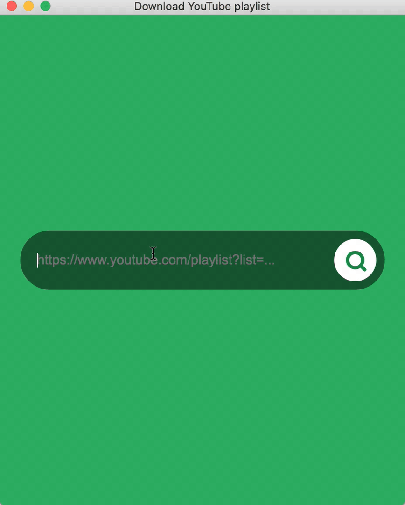

## What is "Y2Mp3" app?

A simple desktop application to download Youtube videos to mp3, one by one or all of them.

Mp3 files will be saved to a **y2mp3** folder in the **Download** folder

## Supported os

## Download

- Free 💰
- No ads 📣

Find your download: [https://github.com/moshfeu/y2mp3/releases/latest](https://github.com/moshfeu/y2mp3/releases/latest)

## Change log

##### 1.1.0
Allow fetch and download a single video

##### 1.0.0
Fetch videos from youtube playlist and download them one by one or all.

## Disclaimer

1. Please use this app for downloading only public resources.
2. The app doesn't store ANY media files ANYWHERE except on the device who use this app.

  Icons made by <a href="https://www.flaticon.com/authors/pixel-perfect" title="Pixel perfect">Pixel perfect</a> from <a href="https://www.flaticon.com/" title="Flaticon">www.flaticon.com</a> is licensed by <a href="http://creativecommons.org/licenses/by/3.0/" title="Creative Commons BY 3.0" target="_blank">CC 3.0 BY</a>

## Development

    npm run webpack
    npm run electron

### Stack

- [electron](http://electronjs.org/)
- [reactjs](https://reactjs.org/)
- [typescript](https://www.typescriptlang.org/)
- [webpack](https://webpack.js.org/)

#### Tests

- [jest](https://jestjs.io/)

#### Libraries

- [youtube-mp3-downloader](https://github.com/ytb2mp3/youtube-mp3-downloader)
- [youtube-playlist](https://github.com/CodeDotJS/youtube-playlist)
- [ffbinaries](https://github.com/vot/ffbinaries-node)

### TODO

🖖🎖 Thanks you for your willing to contribute! You can find the list in the [project](https://github.com/moshfeu/y2mp3/projects/1#column-3954836) page.

## License
MIT