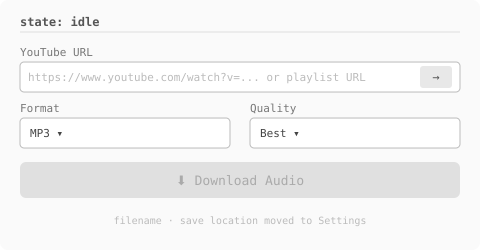
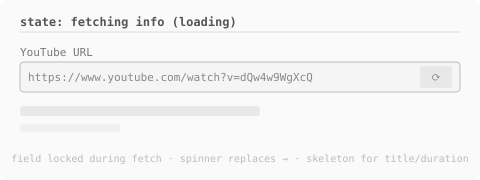
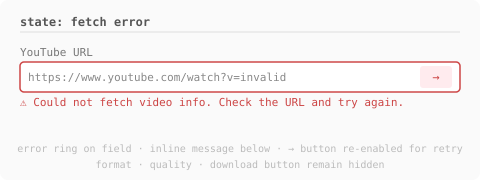
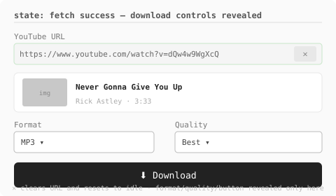
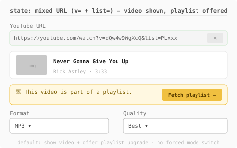
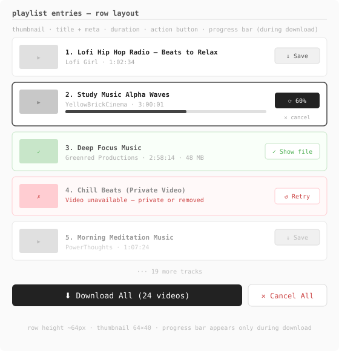
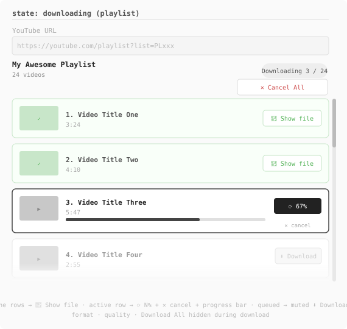
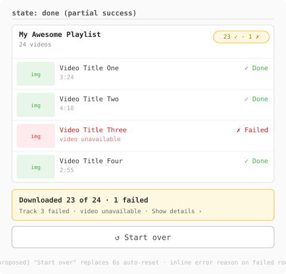
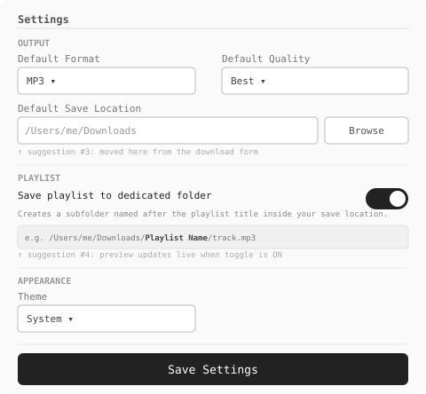
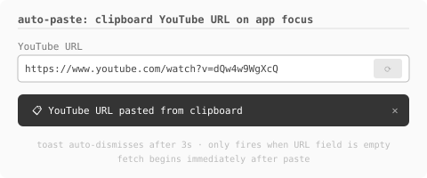

# y2mp3 — Download Flow UX Spec
> React + Electron · Reference for implementation, design review, and QA

---

## Wireframes

| idle | fetching info |
|---|---|
|  |  |

| fetch error | fetch success (controls revealed) |
|---|---|
|  |  |

| mixed URL (video + playlist offer) | playlist rows (scrollable) |
|---|---|
|  |  |

| downloading | done (partial success) |
|---|---|
|  |  |

| settings screen | auto-paste notification |
|---|---|
|  |  |

---

## 1. Entry Points & URL Handling

| URL Type | Detection | Behaviour |
|---|---|---|
| `youtube.com/playlist?list=...` | `list=` only | Fetch → playlist row layout |
| `youtube.com/watch?v=xxx&list=yyy` | both `v=` and `list=` | Fetch video → show video card + "Fetch playlist →" offer banner |
| `youtu.be/xxx` or plain watch URL | no `list=` | Fetch → single video card |

**Mixed URL (both `v=` and `list=`):** Default to the single video. A yellow banner below the video card reads *"🎵 This video is part of a playlist"* with a **Fetch playlist →** button. Clicking it re-fetches as a playlist and transitions to the playlist row layout. There is no automatic mode switch — the user is always in control.

### 1.1 Auto-paste from clipboard
When the app window gains focus **and** the URL field is empty, the app reads the clipboard. If it contains a valid YouTube URL:
1. The URL is pasted into the field automatically.
2. Fetch is triggered immediately.
3. A dismissible in-app toast appears: *"YouTube URL pasted from clipboard"* (auto-dismisses after 3s).

If the URL field already has content, clipboard auto-paste is skipped.

---

## 2. States & Transitions

```
idle
  │  user types/pastes URL  OR  clipboard auto-paste on focus
  │  clicks inline [→] Fetch button  (Enter key also triggers)
  ▼
fetching
  │  getVideoInfo() IPC call
  ├─ playlist-only URL ──▶ playlist rows (+ format/quality/Download All appear)
  ├─ mixed URL (v= + list=) ──▶ single video card  +  "Fetch playlist →" banner
  │                               └─ user clicks "Fetch playlist →" ──▶ fetching (playlist) ──▶ playlist rows
  └─ plain video URL ──▶ single video card (+ format/quality/Download appear)

playlist rows
  │  user reviews entries (thumbnail, title, duration)
  │  clicks Download All              ──▶  downloading (sequential)
  ▼
downloading
  │  active row: progress bar, ⟳ N% badge, ✕ cancel row
  │  done row:   green tint, 📂 Show file button
  │  failed row: red tint, error reason inline, ↺ Retry button
  │  header:     Downloading N / total + Cancel All button
  ├─ all items resolved ──▶ done
  └─ Cancel All          ──▶ done (partial)

done
  │  summary: "Downloaded X of Y · N failed"
  │  single video: 📂 Show in Finder button
  │  ↺ Start over button resets to idle
```

---

## 3. What the User Sees at Each State

### 3.1 `idle` (no info fetched yet)
- URL input with inline `[→]` Fetch button.
- Fetch button disabled until URL is a valid YouTube URL.
- **Format, Quality, and Download button are hidden** until fetch succeeds.
- If clipboard auto-paste fires, a toast appears briefly above the input.

### 3.2 `fetching`
- Fetch button becomes a spinner (disabled).
- URL field disabled.

### 3.3 `playlist rows` (after successful playlist fetch)
- List of entry rows (see §4 for row anatomy).
- Rows are scrollable; all entries rendered (no cap).
- Format + Quality selects appear (were hidden in idle).
- `⬇️ Download All (N videos)` primary button.
- Each row has a per-row `⬇ Download` button — clicking it downloads **that clip only**, regardless of whether Download All has been started.
- The per-row button remains visible and clickable while a clip is queued (waiting for Download All to reach it).

### 3.4 `single video card` (after successful single fetch)
- Card: thumbnail, title, author, duration.
- Format + Quality selects appear.
- `⬇️ Download Audio` button.

### 3.5 `downloading`
- Active row: visible border, progress bar below meta, `⟳ N%` badge, `✕ cancel` link.
- Done rows: green tint, `📂 Show file` button.
- Failed rows: red tint, **error reason inline in the row** (not as a global alert), `↺ Retry` button.
- Header: `Downloading N / total...` + `✕ Cancel All` button.
- Format/Quality hidden during download.
- Global error alert is suppressed in playlist mode — errors live in the rows.

### 3.6 `done`
- Playlist: summary alert `"Downloaded 23 of 24 · 1 failed"` (or `"All 24 downloaded"`).
- Single video: success message + `📂 Show in Finder` button.
- Failed rows remain visible with error + Retry.
- `↺ Start over` button resets form to idle.

---

## 4. Playlist Entry Row Anatomy

```
┌──────────────────────────────────────────────────────────┐
│ [thumb]  Title of the Video                    [action]  │
│          duration                                        │
│          [progress bar — visible during download only]   │
│          [error reason — visible when failed]            │
└──────────────────────────────────────────────────────────┘
```

| Element | Detail |
|---|---|
| Thumbnail | 64×40px, rounded corners, numbered placeholder if not available |
| Title | Semi-bold, truncated to 1 line |
| Duration | Muted, shown when not failed |
| Error reason | Replaces duration when `status === 'failed'` — shown inline in row |
| Action | See states below — **hidden in pending state before download starts** |
| Progress bar | Full row width below meta, visible only when `status === 'downloading'` |

**Action button/badge states:**

| Entry status | Shown | Style |
|---|---|---|
| pending (before Download All) | `⬇ Download` | Muted outline — downloads this clip only |
| pending (queued by Download All, not yet active) | `⬇ Download` | Lighter muted — still clickable to jump-download |
| downloading | `⟳ N%` + `✕ cancel` | Dark badge + muted link |
| done | `📂 Show file` | Outline, green |
| failed | `↺ Retry` | Outline, red |

---

## 5. Settings Screen

### 5.1 Output (save location moved here)

| Setting | Type | Detail |
|---|---|---|
| Save location | Path input + Browse button | Replaces field on download form |
| Playlist subfolder | Checkbox | When ON: saves to `<save location>/<playlist title>/` |

**Playlist subfolder behaviour:**
- Folder name sanitized (strip `:/?*"<>|`, max 80 chars).
- Reused silently if already exists.
- Live path preview: `~/Downloads/My Playlist/`

### 5.2 Keyboard shortcut
- `⌘,` (macOS) / `Ctrl+,` (Windows/Linux) opens the Settings tab.

---

## 6. Inline Fetch Button

- Icon button (`→`) inside right edge of URL input.
- `aria-label="Fetch video info"`, keyboard-focusable, Enter triggers it.
- States: enabled (valid URL) → spinner (loading) → re-enables on URL change.

---

## 7. History Panel

- Each history entry shows: thumbnail, title, author, timestamp, file size.
- **"Show in Finder" only shown for `status === 'completed'` entries** — never for failed ones.
- Failed entries show a muted error badge instead.

---

## 8. Resolved Issues

| Issue | Resolution |
|---|---|
| No cancel | Per-row `✕` + `Cancel All` button |
| No error detail | Inline error reason in the failed row — no global alert in playlist mode |
| Hidden entries (>50 cap) | All entries rendered (no cap) |
| Generic success on partial failure | `"Downloaded X of Y · N failed"` summary |
| 6s auto-reset | Replaced with `↺ Start over` button |
| Blur-triggered fetch | Replaced with inline `[→]` button |
| Mixed URL choice modal | Eliminated — per-row actions |
| Save location on every form | Moved to Settings |
| Playlist subfolder | Settings toggle with live path preview |
| Dot status before download | Status column hidden until download starts |
| Global error shown below playlist | Errors live in rows; global alert suppressed in playlist mode |
| History shows "Show in folder" for failed | Hidden for failed entries |
| Format/Quality shown before URL is ready | Hidden until fetch succeeds |
| Clipboard URL not auto-pasted | Auto-paste on focus + dismissible toast |
| No keyboard shortcut for settings | `⌘,` / `Ctrl+,` |
| Thumbnails not loading | Electron CSP allowlist for YouTube CDN |
| Settings state reset on tab switch | Lift state / keep DownloadForm mounted |
